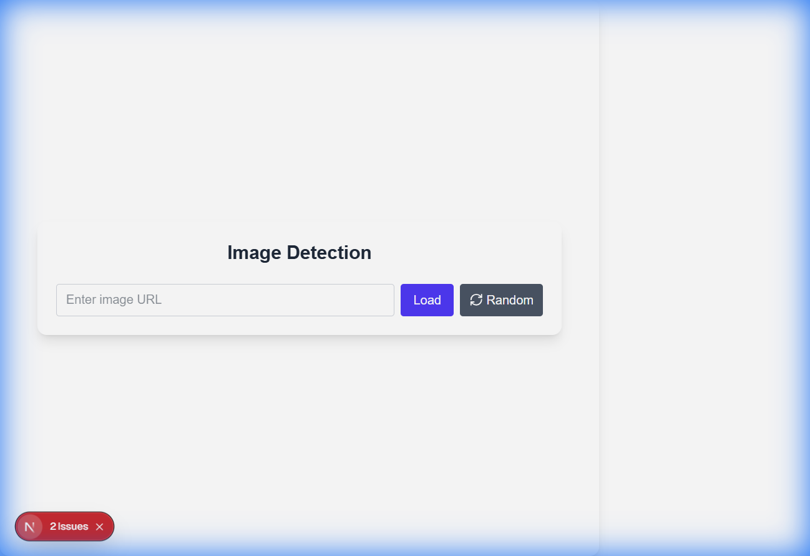

# Walkthrough: Image Detection Web App

## What was accomplished
- Initialized a Next.js project in `image-detect`.
- Installed required dependencies: `@tensorflow/tfjs`, `@tensorflow-models/coco-ssd`, `lucide-react`.
- Created `components/ImageDetector.tsx` implementing:
  - Client‑side directive (`"use client"`).
  - Image URL input, random image button (picsum.photos).
  - Loading of COCO‑SSD model with TensorFlow.js.
  - Detection of objects and display of results.
  - Modern UI using Tailwind CSS with glassmorphism style.
- Updated `app/page.tsx` to embed the new `ImageDetector` component and removed the default template.
- Ran the development server (`npm run dev`) and resolved the server‑component error by adding the client directive.
- Verified that the UI loads correctly in the browser (see attached screenshot).

## Manual verification steps

1. Open `http://localhost:3000`.
2. Use the **Random** button to load a random image.
3. Observe the detection results list below the image.
4. Paste any image URL into the input field and press **Load** to test custom images.

If the detection list shows class names and confidence scores, the implementation is working.

## Next steps (optional)
- Add bounding‑box overlay on the image.
- Improve error handling for CORS‑restricted URLs.
- Write automated tests for the component.
